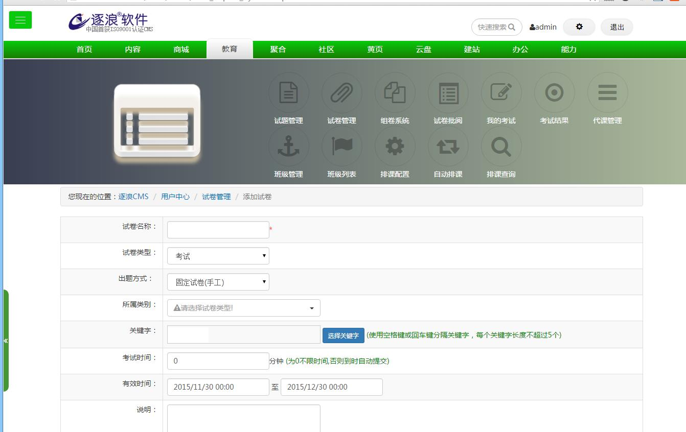
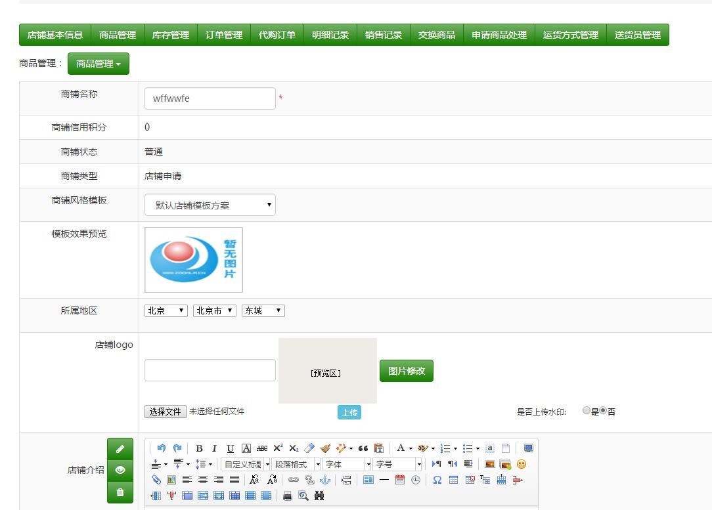
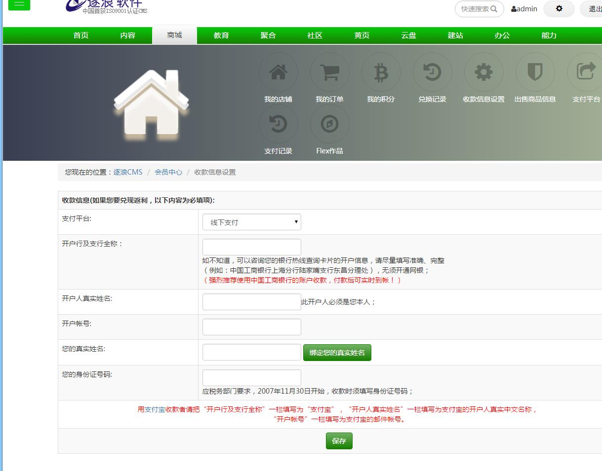
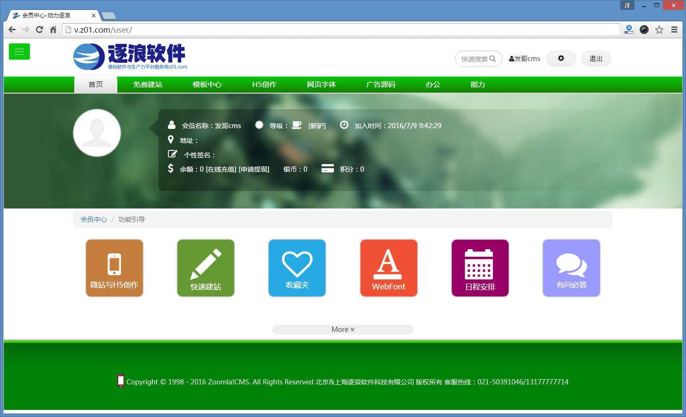
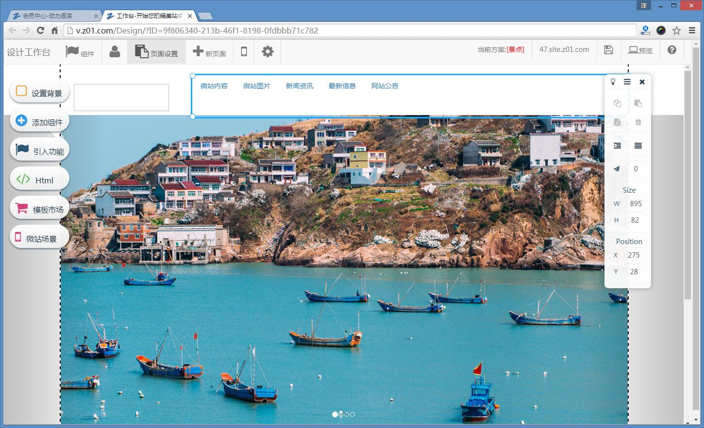

  

<!-- TOC -->

- [💻专注web开发-做中国原创顶级网站内容管理系统](#💻专注web开发-做中国原创顶级网站内容管理系统)
    - [🍈源码结构：](#🍈源码结构)
    - [🛄 官方支持](#🛄-官方支持)
    - [🍎CMS系统理念](#🍎cms系统理念)
        - [作为web开发，CMS是支撑网站运营的内核。](#作为web开发cms是支撑网站运营的内核)
    - [🖥 支持环境](#🖥-支持环境)
    - [💓对未来的理解](#💓对未来的理解)
    - [📖官方介绍](#📖官方介绍)
    - [🍂链接导航](#🍂链接导航)
        - [🌚功能图赏 （以下只有图无正文）](#🌚功能图赏-以下只有图无正文)

<!-- /TOC -->

<h1 align="center">Zoomla!逐浪CMS开源项目库</h1>

## 💻专注web开发-做中国原创顶级网站内容管理系统

### 🍈源码结构：

|  目录名称 | 框架  | 说明  |
| ------------ | ------------ | ------------ |
|  ZoomLa逐浪CMS_1.0源码 | 基于.net2.0框架的CMS内核源码  | 对于32位操作系统有着良好的支持  |
|  Zoomla逐浪CMS2_x3.8源码-webform | 基于.net4.0框架的CMS内核源码  | webform框架，原生的win2012r2操作系统研发，企业级开发。  |
|  Zoomla逐浪CMS2_x3.9源码-mvc | 基于.net4.5框架的CMS内核源码  | MVC框架，原生的win2016操作系统研发，企业级开发,更加卓越的性能。  |

### 🛄 官方支持

Zoomla!逐浪CMS：中文业界alexa排名第一的CMS系统|专注.net与windows平台企业级研发，集成内容管理、webfont、商城、店铺、黄页、教育、考试、3D、三维全景、混合现实、CRM、ERP、OA、论坛、贴吧等为一体，打造国内高端的CMS产品典范。

官网：www.z01.com

免费下载：www.z01.com/mb

视频教程：www.z01.com/mtv

模板资源：www.z01.com/mb

QQ交流群号：
    

官方QQ客服：
   

未来我们将全面开放转入到基于微软.netCore内核平台研发，并通过<a href="http://www.73ic.com">【去上云73ic.com】</a>平台为大家提供服务。

😛😜😝😒😓😔😕😲😛😜😝😒😓😔😕😲
传送门->对于新版Zoomla!逐浪CMS v8（即基于.net Core内核的全新一代CMS，目前已经投入商用，并面向商业用户和VIP会员进行投递，如果您感兴趣，可以访问我们官网<a href="http://www.z01.com">www.z01.com</a>获得相应支持，本库用于逐浪CMS历史版本开源计划。

### 🍎CMS系统理念
 
尤其是对于当前有中国win7+ppt的时代，企业级CMS系统非常少。
即使是在2019年3月1日这个时间点上，被誉为民族IT代表X米所售[八代]主流笔记本电脑还是“8GB内存”，主流出机还是以DDR3为配置，这并不值得我们这个民族自豪。
鼓吹会飞的猪、滥用大数据、曲解云计算、歪曲移动互联网、吹捧弯道超车，而没有低头做事、披星戴月的精神，凭空不会出未来。

#### 作为web开发，CMS是支撑网站运营的内核。

中国的CMS发展经历了几代：
* 第一代产品以简易的内容建站，如Bbsxp\动力文章系统。
* 第二代产品进入了论坛社区时代，其中以Dusicz!为代表，可惜最后Dusicz!被腾讯收编，成为广告的散发机。
* 第三代产品位于站群与移动时代，以逐浪CMS为代表，移入办公应用、移动、大数据、ERP、教育系统，从而形成完整的开发生效。

在逐浪CMS的产品中，  
我们认为网站不是广告的颁发中心，而是内容的运营中心，  
是企业私有数据的运营起点。  

我们不否认公有云的贡献，  
但一个企业如果没有任何私有节字，  
是不会有明天的。

今天中国已经有很多企业越来越认识到自有数据和自有平台的重要性，  
我们看到太多的企业构建网站，不到一年就后台漏洞百出，甚至有的CMS从一开始就是打着“免费”的幌子，后台盗用数据、投放广告。  
逐浪要做鲁棒卓越的CMS，永远只拥抱最新的windows server，而不是以最大兼容去适配低端OS。  
网站开发是一件神圣的事，同时也是企业级开发，不是儿戏。

### 🖥 支持环境

* 现代浏览器和 IE9 及以上。
* 支持服务端渲染。
* [Electron](http://electron.atom.io/)

|  IE / Edge |  Firefox |  Chrome |  Safari |  Opera |  Electron |
| --------- | --------- | --------- | --------- | --------- | --------- |
| IE9, IE10, IE11, Edge| last 2 versions| last 2 versions| last 2 versions| last 2 versions| last 2 versions

### 💓对未来的理解
 
今天这个互联网，AI、物联网、车联网、神经网络层出不穷，但是基于WEB表现的核心技术依然是HTML技术，其背后依赖的内核是CMS中间件，Zoomla!逐浪CMS作为国内第一阵营的领导品牌，坚持推陈出新，推动国内WEB与移动互联网技术的成长。

今天这个互联网，技术层出不穷，新思维暗流涌动。
- 传统网页基于一行一行的HTML构成，可早已进化到以Emmet简写展开，1码10行（甚至更多）的境界。
- 传统网页基于原生CSS呈现，高手已经在基于sass和less进行编程化样式编译。
- 传统网站多用ps做图展示，前沿的逐浪CMS已经早早的引入svg矢量画图技术。
- 传统网站图标多基于JPG/PNG/GIF等点阵图呈现，而基于Webfont的字库技术大大推进了展现领域。
- 你所熟悉的网页结构，已被React、AngulaJS等新web技术使传统网页开发面貌大大提升。
- 以及基于Git、PowerApp、混合现实、AR、MR技术，正是：一日千里，始于基石。
这都在全新的Zoomla!逐浪CMS2 x3.9.3中得到了淋漓尽致的体现，作为成熟的CMS软件厂商，我们从不只为标新立异、哗众取宠，而是既关注全新技术，又适时的引入成熟的商业技术；既保留对旧版本的兼容，同时又在底层上追求进步，从而保证商业级的CMS和生产力软件研发平台定位的技术先进性。

科学技术是第一生产力。
Zoomla!逐浪CMS用技术推进研发。

### 📖官方介绍
 
“追逐未来、只争第一”--逐浪软件企业集团体拥有10余年的软件和互联网研发基础，旗下拥有逐浪软件、字体网(ziti163.com)、华夏互联、华夏营销网四大门户，拥有北京、上海、南昌两大全资集团化研发公司，逾十年网站开发、web底层研发、移动开发、电商解决方案与综合大数据开发方案服务经验，服务包括政府、军工、外企、世界五百强企业和诸多本土站长，致力于打造最优秀的网站内核管理系统。  
逐浪®CMS作为国内顶尖、华中地区（苏、浙、皖、湘、鄂、豫、赣）唯一自主知识产权的网站管理系统（CMS）开发商，独有的“沙箱”开发理念，赢得了高端用户和开发者推崇，完全开放的软件体制更是行业翘楚...  
逐浪软件诞生自2006年，目前已经形成北京、上海、南昌三大运营中心  
作为中国互联网第一代企业一员，我们既分享了这个时代改革开放的成就与礼遇，亦秉承了上个世纪又红又专、守真志满、礼克己复礼优良品质。  
公司成立伊始，即以服务于中国互联网老牌企业-华夏互联的全线软件业务为己任，专注于CMS和WEB软件研发。  
   

### 🍂链接导航
 
我们产品是基于Microsoft.Net4.0（开源版本为NET2.0）+MSSQ2005以及更高版本，产品免费开放，并提供云模板。
  

我们的官网：http://www.z01.om  

关于逐浪CMS的最新版本，我们发布在官方平台，免费下载：http://www.z01.om/pub  

视频教程：http://www.z01.om/mtv

使用手册：http://help.z01.om

在线社区：http://bbs.z01.om

技术服务热线：021-50391046/13177777714

全新移动平台上线：http://app.z01.om

#### 🌚功能图赏 （以下只有图无正文）

